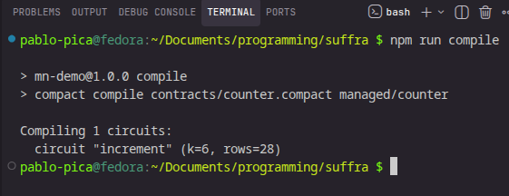
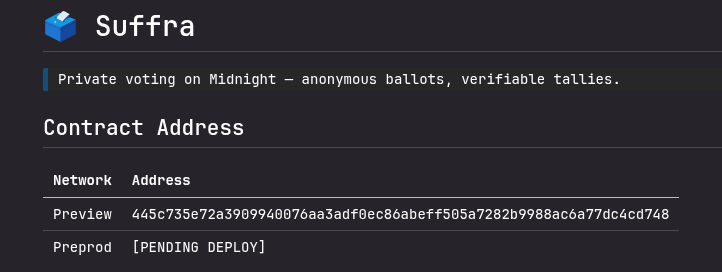

# 🗳️ Suffra

> Private voting on Midnight — anonymous ballots, verifiable tallies.

[](https://github.com/pablo-pica/suffra/actions/workflows/ci.yml)

## 📌 Submission Resources & Links

| Resource | Value / Link |
| :--- | :--- |
| **Preview Contract Address** | `445c735e72a3909940076aa3adf0ec86abeff505a7282b9988ac6a77dc4cd748` |
| **Live Demo dApp** | [suffra-pica.vercel.app](https://suffra-pica.vercel.app) |
| **Demo Video (YouTube)** | [youtu.be/G3Ppbny50tc](https://youtu.be/G3Ppbny50tc) 🎬 |
| **Product Proposal** | [PROPOSAL.md](PROPOSAL.md) *(The Turn — Private Voting)* |
| **Demo Video Script** | [docs/DEMO-VIDEO.md](docs/DEMO-VIDEO.md) |
| **CI/CD Workflow** | [.github/workflows/ci.yml](.github/workflows/ci.yml) |
| **Level Progress Tracker** | [docs/PROGRESS.md](docs/PROGRESS.md) |


---

## 🎯 What This Does

Suffra is a private voting application built on Midnight that enables anonymous ballot casting with publicly verifiable tallies. Using Midnight's zero-knowledge proof system, voters can cast ballots without revealing their identity or their choice to anyone — yet the final tally is cryptographically verified and publicly auditable.

---

## 🔒 Privacy Model

- **What is PUBLIC** (on-chain, visible to anyone): Vote tallies per option, proposal metadata, voting period status, nullifiers (prevent double-voting).
- **What is PRIVATE** (private witness, never on-chain): Individual ballot choice, voter identity, eligibility proof details.
- **What the user PROVES without revealing**: That their vote is valid, that they are eligible to vote, and that they haven't voted before — all without exposing who they are or what option they selected.

---

## 🛠️ Tech Stack

- **Midnight Network & Compact Language** (on-chain smart contracts & circuits)
- **Vite + React + TypeScript** (frontend dApp)
- **Tailwind CSS v4 + Framer Motion** (modern design & fluid ZK state micro-animations)
- **Lace Wallet (Midnight Edition)** (wallet connection & proving provider)
- **Vitest & GitHub Actions** (automated testing & CI/CD pipeline)

---

## ⚡ Quickstart & Setup

```bash
# Clone the repository
git clone https://github.com/pablo-pica/suffra.git
cd suffra

# Install dependencies
npm install

# Start Midnight local proof server (Docker required)
docker run -p 6300:6300 midnightnetwork/proof-server

# Run TypeScript type check & unit tests
npm run test

# Start local frontend dev server
npm run dev
```

---

## 🧪 Run Tests

```bash
npm run test
```

> **Passing Test Suite:** 3/3 tests passing in `tests/counter.test.ts` covering contract initialization, private witness increment circuit execution, and ledger privacy invariant enforcement.

---

## 💡 Product Proposal — The Turn

Suffra fulfills Idea #1 (*Private Voting*) from the official Midnight hackathon idea list. Read our full architecture, data model breakdown, and Mainnet feasibility roadmap in [PROPOSAL.md](PROPOSAL.md).

---

## 📸 Screenshots

### Successful Compact Compile


### Deployed Contract Address


---

## 🎥 Demo Video Guide

Detailed steps for recording the unified 1-minute demo video covering Level 2 and Level 3 submissions are outlined in [docs/DEMO-VIDEO.md](docs/DEMO-VIDEO.md).
